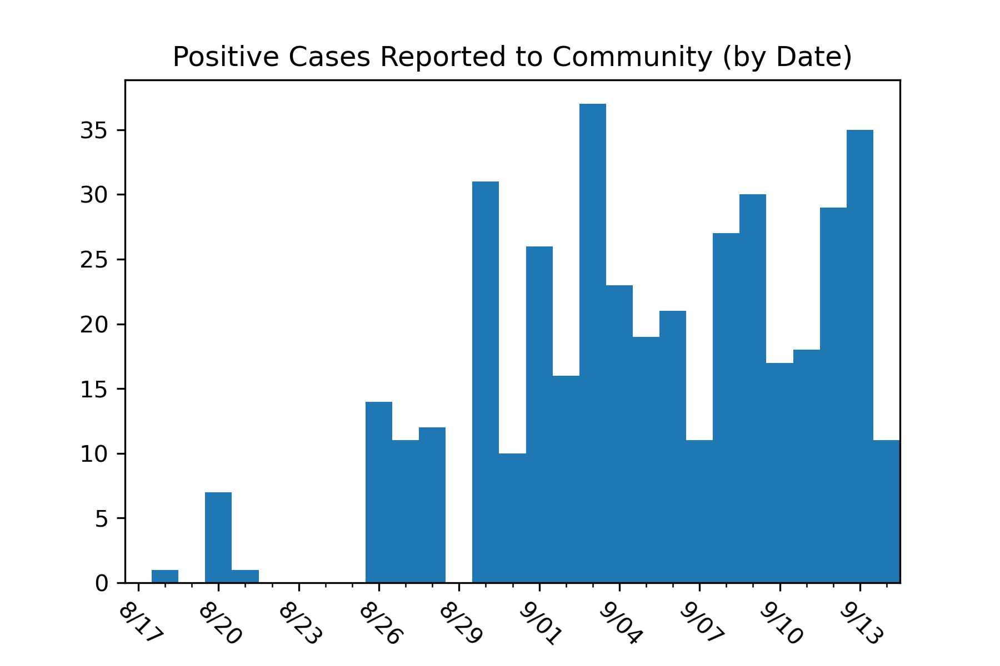
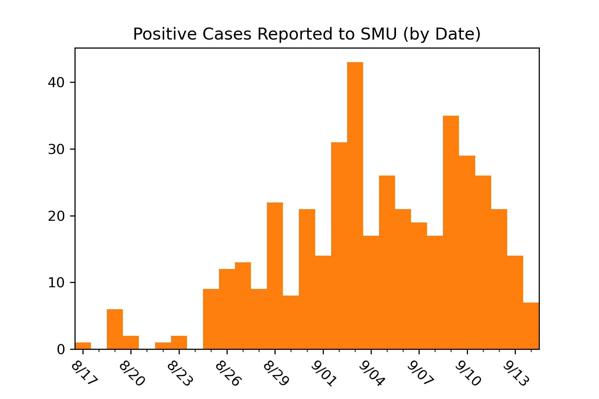
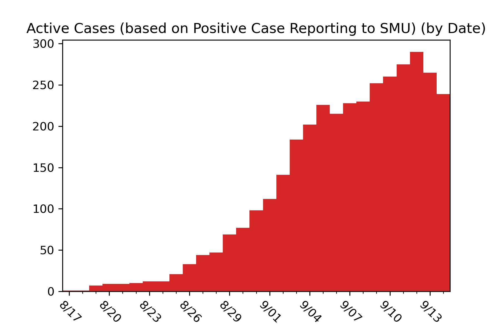
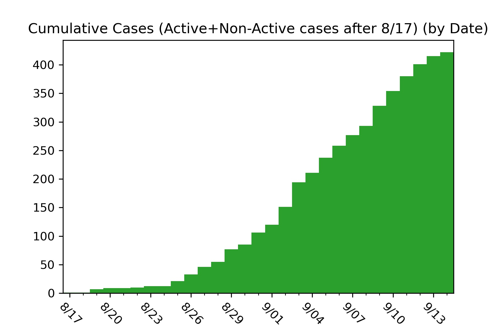
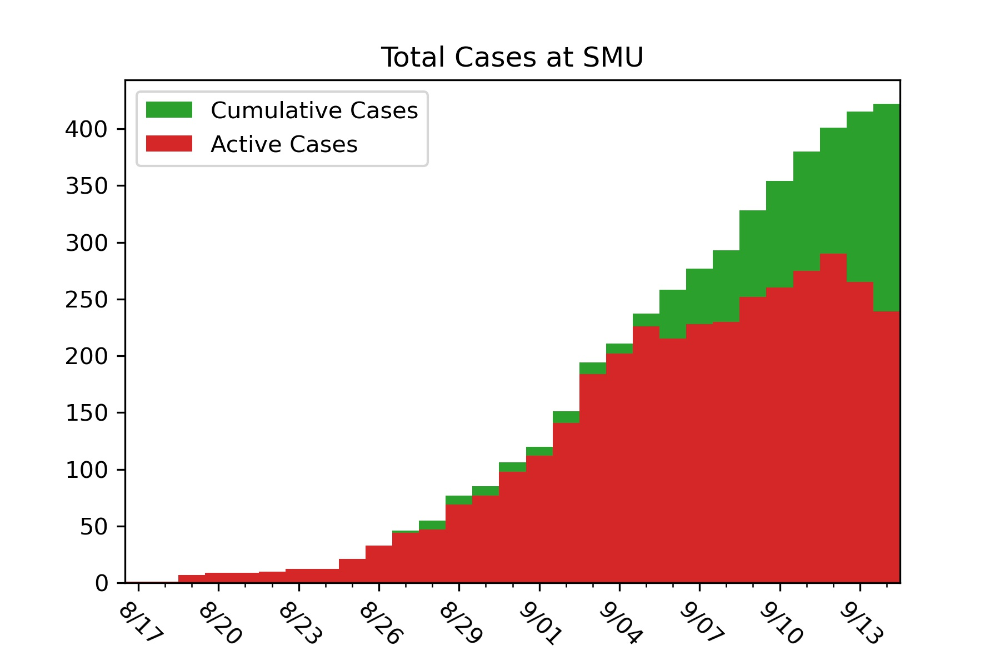

# SMU COVID-19 Case Tracker

Southern Methodist University has begun publishing case information for COVID-19 around campus for Fall 2020. The raw data is reported each day at https://blog.smu.edu/coronavirus-covid-19/cases/. I am interested in mapping four separate trends in the data.

* The Positive Cases Reported to the SMU Community (Notification Numbers)
* The Positive Cases Reported to SMU (Case Numbers)
* The Total Active Cases on Campus (Active Case Numbers)
* The Total Cumulative Cases on Campus (Active Case Numbers + Inactive Case Numbers) (Note: Cases before August 17th are not included)

SMU currently only displays active cases on their website so the data can only represent active cases at the time I pulled the data. The first day I pulled data was August 28, 2020. Any cases reported before August 17th or any cases that were labeled "no longer active", and thus not on the website, before August 28th would not be included in the data.

The plotting is generated in the Codes/COVID_data_plotting.py file, which is where I will put daily updated case information. Images/.. contains the graphics of the data, which are presented below for convience.

Most Recent Update: 5:10 PM 09/15/2020

I am one of MANY students reporting information on SMU's COVID Data. For other (and better) visuals, check out:

Jonathan Lindbloom's [Github](https://github.com/Jonathan-Lindbloom/SMU-COVID-19) and [Dashboard](https://public.tableau.com/profile/jonathan.lindbloom#!/vizhome/SMUCOVID-19InteractiveDashboard/Dashboard)  
Noah Pearson's [Github](https://github.com/NoahPearson/SMU_Covid-19_Tracking)  
SMU's AI Club's [Dashboard](http://covid.smuaiclub.com/)
