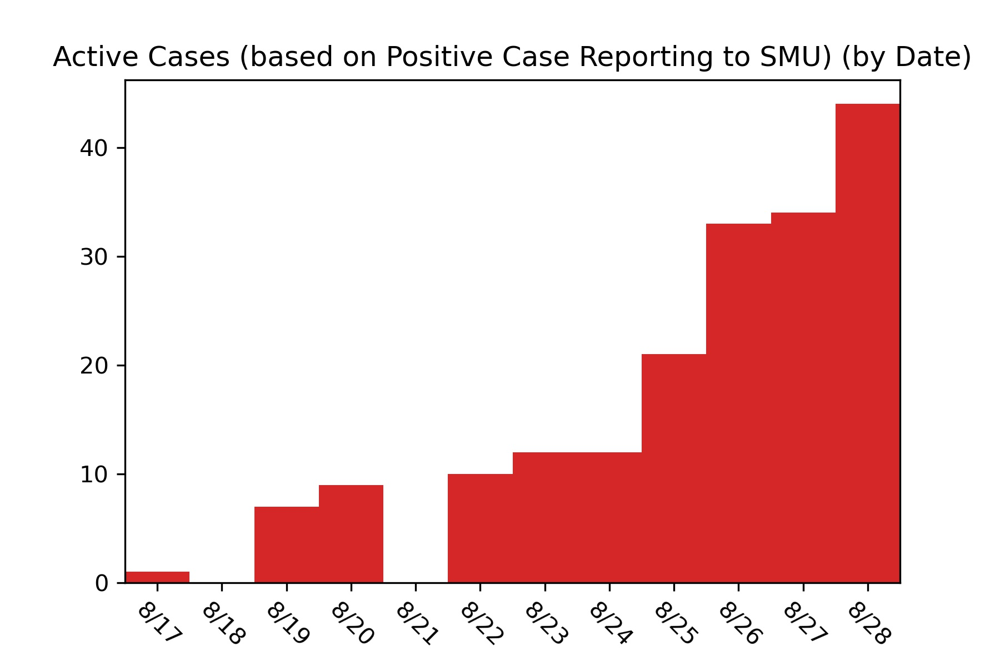

# SMU COVID-19 Case Tracker

Southern Methodist University has begun publishing case information for COVID-19 around campus for Fall 2020. The raw data is reported each day at https://blog.smu.edu/coronavirus-covid-19/cases/. I am interested in mapping three separate trends in the data.

* The Positive Cases Reported to the SMU Community (Notification Numbers)
* The Positive Cases Reported to SMU (Case Numbers)
* The Total Active Cases on Campus (Active Case Numbers)

SMU currently only displays active cases on their website so the data can only represent active cases at the time I pulled the data. The first day I pulled data was August 28, 2020. Any cases reported before August 17th or any cases that are labeled "no longer active" before August 28th would not be included in the data.

I will include daily updates to the code with the data and then include the most recent graphics in this README file.

*Insert Images Here*

