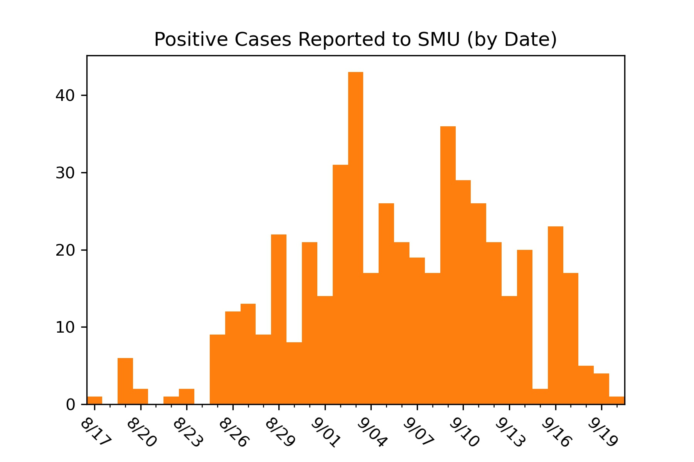
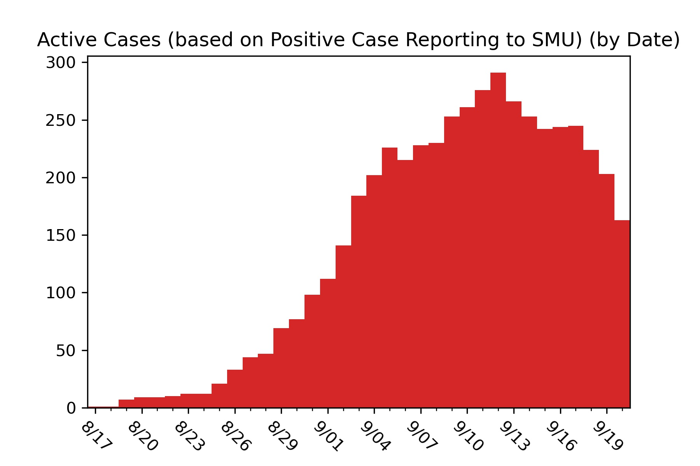
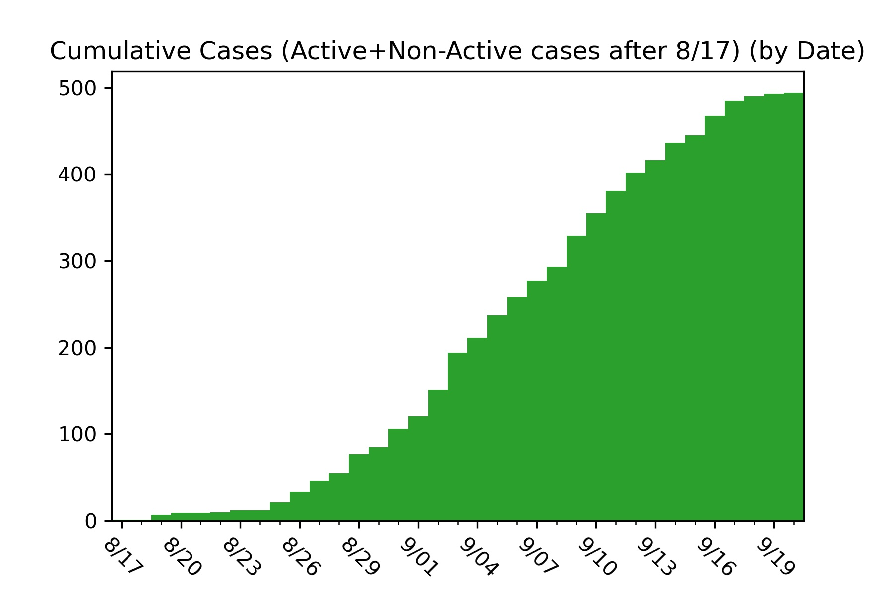
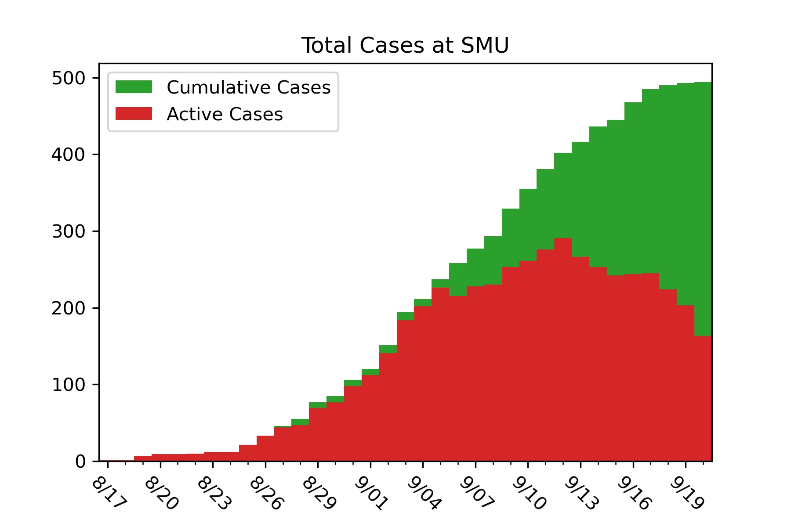

# SMU COVID-19 Case Tracker

Southern Methodist University has begun publishing case information for COVID-19 around campus for Fall 2020. The raw data is reported each day at https://blog.smu.edu/coronavirus-covid-19/cases/. I am interested in mapping four separate trends in the data.

* The Positive Cases Reported to the SMU Community (Notification Numbers)
* The Positive Cases Reported to SMU (Case Numbers)
* The Total Active Cases on Campus (Active Case Numbers)
* The Total Cumulative Cases on Campus (Active Case Numbers + Inactive Case Numbers) (Note: Cases before August 17th are not included)

SMU currently only displays active cases on their website so the data can only represent active cases at the time I pulled the data. The first day I pulled data was August 28, 2020. Any cases reported before August 17th or any cases that were labeled "no longer active", and thus not on the website, before August 28th would not be included in the data.

The plotting is generated in the Codes/COVID_data_plotting.py file, which is where I will put daily updated case information. Images/.. contains the graphics of the data, which are presented below for convience.

Most Recent Update: 3:09 AM 09/21/2020

### Opinion Section

I don't want to impose intepretations without evidence on the data so this section is after my display of the data. Since I am not involved in the data gathering, I do not make prediction models for campus nor include inferences about trends. However, the last three days of reporting from SMU is concerning. I am not making any claims or identifying answers to my concerns, but I just want to caution anyone looking at my graphics that I have no way to know if students are being honest in reporting to the university. Several students have approached me to express the same concerns and there are rumors, which I won't make here since I lack concrete evidence, of larger issues. In total, these lead me to be cautious about making comments about the trend of positive cases at SMU. If more information comes to light as trends continue, in whatever direction they may go, I may remove/adjust this comment, but I just wanted to express my concern here.

I am one of MANY students reporting information on SMU's COVID Data. For other (and better) visuals, check out:

Jonathan Lindbloom's [Github](https://github.com/Jonathan-Lindbloom/SMU-COVID-19) and [Dashboard](https://public.tableau.com/profile/jonathan.lindbloom#!/vizhome/SMUCOVID-19InteractiveDashboard/Dashboard)  
Noah Pearson's [Github](https://github.com/NoahPearson/SMU_Covid-19_Tracking)  
SMU's AI Club's [Dashboard](http://covid.smuaiclub.com/)
